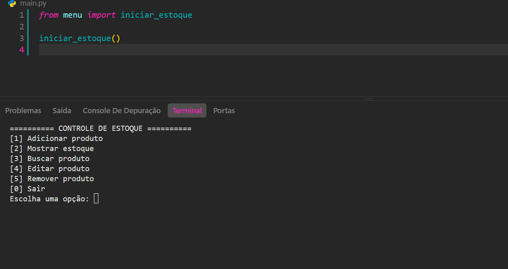
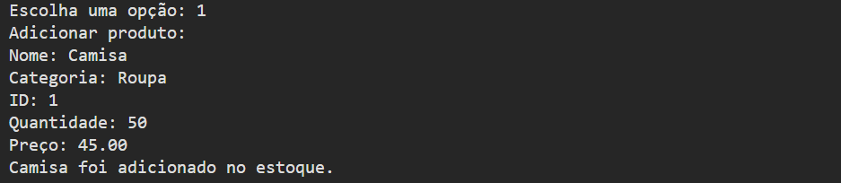
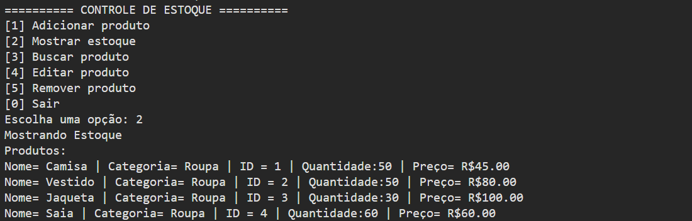

# Controle de Estoque

Sistema simples de controle de estoque desenvolvido em **Python**, criado para praticar conceitos de **Programação Orientada a Objetos (POO)**, estruturas de dados e organização de código em diferentes módulos.

## Demonstração:

### Menu principal



### Cadastro de produto



### Visualização do estoque



## Sobre o projeto:

O projeto simula um sistema básico de gerenciamento de produtos. Através de um menu interativo no terminal, é possível cadastrar, visualizar, buscar, editar e remover produtos do estoque.
Os produtos são armazenados em um **dicionário**, utilizando o ID como chave para facilitar a busca e o gerenciamento dos dados.
Este projeto faz parte da minha jornada de aprendizado em Python e será aprimorado conforme novos conceitos forem estudados.

## Funcionalidades:

* ➕ Adicionar produtos
* 📋 Visualizar produtos cadastrados
* 🔎 Buscar produto por ID
* ✏️ Editar informações de um produto
* 🗑️ Remover produtos
* 🚫 Impedir o cadastro de IDs duplicados
* 💰 Exibir preços formatados em reais
* ⚠️ Informar quando um produto não é encontrado
* 🚪 Encerrar o programa através do menu
* 🆔 Gerar IDs automaticamente
* ⚠️ Validar entradas numéricas
* 🚫 Impedir valores negativos para preço e quantidade
* 📝 Validar campos obrigatórios
* ❓ Solicitar confirmação antes da remoção

## Tecnologias utilizadas:

* **Python 3**
* Programação Orientada a Objetos (POO)
* Dicionários
* Funções
* Módulos e importações
* Terminal/linha de comando

## Estrutura do projeto:

```text
controle-estoque/
│
├── img/
│   ├── menu.png
│   ├── cadastro.png
│   └── estoque.png
│
├── main.py
├── menu.py
├── produtos.py
├── estoque.py
├── .gitignore
└── README.md
```

### `main.py`

Ponto de entrada da aplicação. Responsável por iniciar o sistema através da função `iniciar_estoque()`.

### `menu.py`

Responsável pela interação com o usuário, exibindo o menu e recebendo as informações necessárias para executar cada operação.

### `produtos.py`

Contém a classe `Produto`, responsável por representar os produtos cadastrados no sistema.

Cada produto possui:

* Nome
* Categoria
* ID
* Quantidade
* Preço

### `estoque.py`

Contém a classe `Estoque`, responsável pelo gerenciamento dos produtos.

Entre suas funções estão:

* Adicionar produtos
* Mostrar o estoque
* Buscar produtos
* Editar produtos
* Remover produtos
* Validar IDs duplicados

## Como executar:

### 1. Clone o repositório

```bash
git clone URL_DO_REPOSITORIO
```

### 2. Entre na pasta do projeto

```bash
cd controle-estoque
```

### 3. Execute o programa

```bash
python main.py
```

## Exemplo de uso:

Ao executar o programa, será apresentado o seguinte menu:

```text
========== CONTROLE DE ESTOQUE ==========
[1] Adicionar produto
[2] Mostrar estoque
[3] Buscar produto
[4] Editar produto
[5] Remover produto
[0] Sair
Escolha uma opção:
```

##  Conceitos praticados:

Durante o desenvolvimento deste projeto foram praticados conceitos como:

* Classes e objetos
* Construtores (`__init__`)
* Atributos e métodos
* Dicionários
* Estruturas condicionais
* Laços de repetição
* Funções
* Importação de módulos
* CRUD
* Validação de dados
* Organização de um projeto em diferentes arquivos
* Tratamento de exceções (`try/except`)
* Validação de dados
* Operadores lógicos

## Próximas melhorias:

* [ ] Refatorar e melhorar a organização do código
* [ ] Implementar persistência dos dados
* [ ] Salvar e carregar produtos utilizando JSON
* [ ] Melhorar a interface do terminal
* [ ] Adicionar novas funcionalidades ao sistema

## Sobre o desenvolvimento:

Este projeto foi desenvolvido como parte da minha prática de **Python e Programação Orientada a Objetos**, com foco em transformar os conceitos estudados em uma aplicação funcional.
A ideia é continuar evoluindo o projeto conforme avanço nos estudos e registrar essas melhorias através do GitHub.

---

⭐ Projeto em desenvolvimento e aprendizado contínuo.
